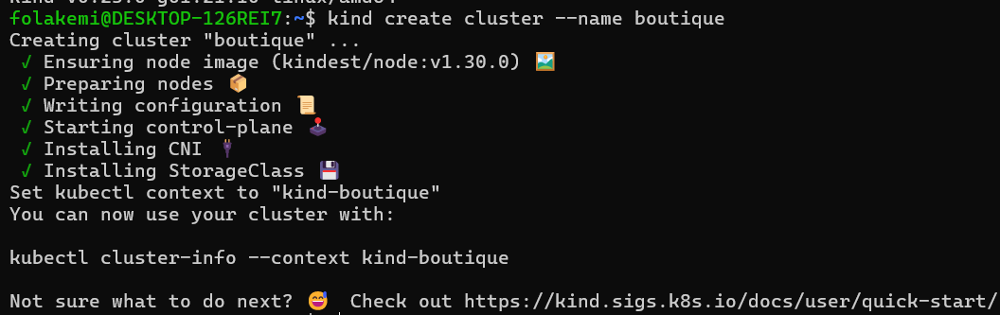
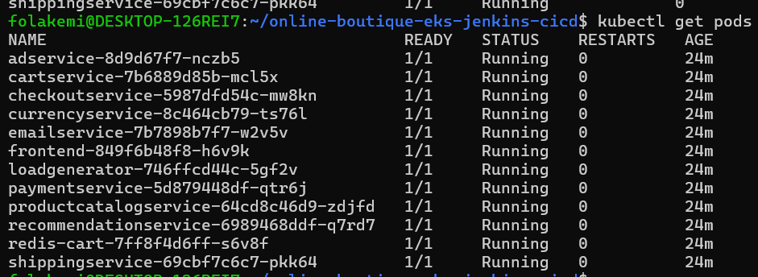
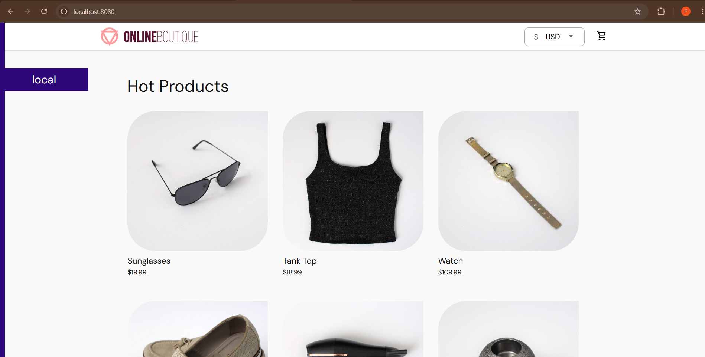
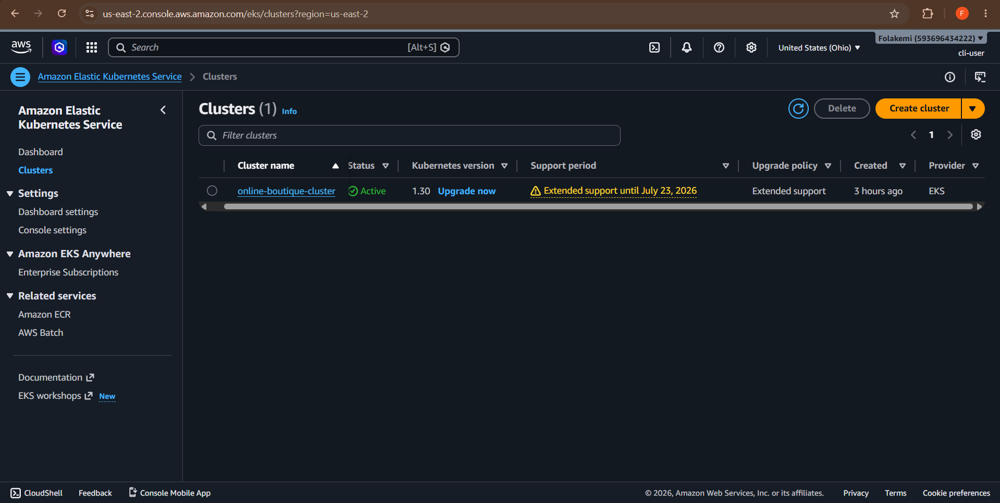
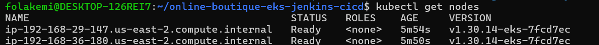
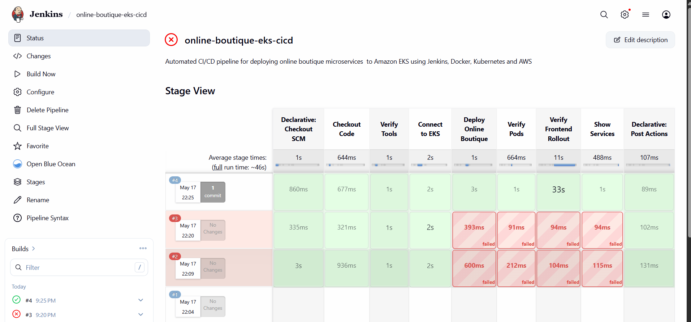
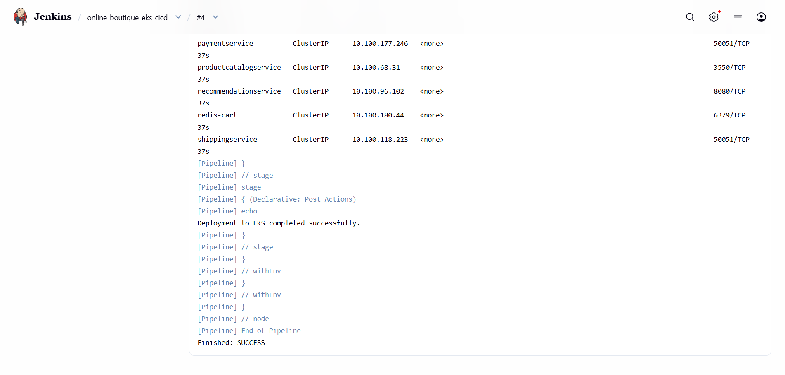
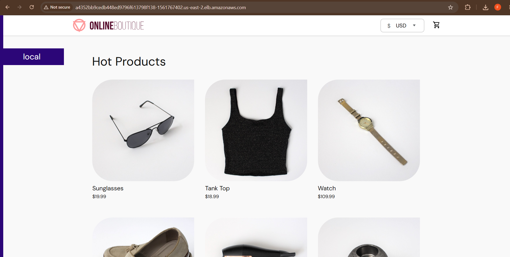

# Jenkins CI/CD Pipeline for Google Online Boutique on Amazon EKS

## Project Overview

This project demonstrates an end-to-end DevOps workflow for deploying Google’s Online Boutique microservices application to Amazon EKS using Jenkins, Kubernetes, eksctl, AWS CLI, and kubectl.

The goal of this project was to simulate a real-world CI/CD deployment workflow for a cloud-native microservices application running on Kubernetes.

The application used is Google Online Boutique. My focus in this project is on DevOps implementation: Kubernetes deployment, Jenkins automation, EKS configuration, deployment verification, troubleshooting, and cloud cost control.

---

## Tools and Technologies Used

| Tool | Purpose |
|---|---|
| GitHub | Source code and documentation |
| Jenkins | CI/CD automation |
| Kubernetes | Container orchestration |
| Amazon EKS | Managed Kubernetes service |
| kubectl | Kubernetes management |
| eksctl | EKS cluster creation |
| AWS CLI | AWS authentication and access |
| Docker | Container runtime |
| Kind | Local Kubernetes testing |
| Ubuntu/Linux | Server environment |

---

## Architecture

```text
Developer pushes code to GitHub
            |
            v
Jenkins pulls repository from GitHub
            |
            v
Jenkins connects to Amazon EKS
            |
            v
Jenkins applies Kubernetes manifests
            |
            v
Amazon EKS schedules microservices pods
            |
            v
Frontend service exposed through AWS Load Balancer
            |
            v
Online Boutique accessible in browser
```

Detailed architecture explanation:

```text
docs/project-architecture.md
```

---

## Local Kubernetes Testing

Before deploying to AWS, I validated the application locally using Kind.

### Commands Used

```bash
kind create cluster --name boutique
kubectl apply -f app/release/kubernetes-manifests.yaml
kubectl get pods
kubectl get svc
kubectl port-forward service/frontend-external 8080:80
```

Application accessed locally through:

```text
http://localhost:8080
```

### Screenshots







---

## Amazon EKS Cluster Setup

The EKS cluster was created using eksctl with a managed node group.

Cluster configuration file:

```text
infra/eks-cluster.yaml
```

### Commands Used

```bash
eksctl create cluster -f infra/eks-cluster.yaml
kubectl get nodes
```

### Screenshots





---

## Jenkins CI/CD Pipeline

Jenkins was installed on a separate Ubuntu EC2 instance and configured with:

- AWS CLI
- kubectl
- Docker

The deployment pipeline is stored in:

```text
jenkins/Jenkinsfile
```

Pipeline stages include:

- Checkout Code
- Verify Tools
- Connect to EKS
- Deploy Kubernetes Manifests
- Verify Pods
- Verify Frontend Rollout
- Show Services

### Screenshots





---

## Deployment Verification

After Jenkins completed the deployment, the application was verified using:

```bash
kubectl get pods
kubectl get svc
kubectl rollout status deployment/frontend
```

The frontend service exposed the application through an AWS Load Balancer.

### Screenshot



---

## Troubleshooting

Common troubleshooting commands used during the project:

```bash
kubectl get pods
kubectl describe pod POD_NAME
kubectl logs POD_NAME
kubectl get svc
kubectl get events --sort-by=.metadata.creationTimestamp
```

Detailed troubleshooting notes:

```text
docs/troubleshooting.md
```

---

## Cost Control and Cleanup

### Delete Application

```bash
kubectl delete -f app/release/kubernetes-manifests.yaml
```

### Delete EKS Cluster

```bash
eksctl delete cluster --name online-boutique-cluster --region us-east-2
```

Additional cleanup notes:

```text
docs/cost-control.md
```

---

## What I Learned

This project helped me understand:

- Kubernetes deployments
- Amazon EKS cluster management
- Jenkins Pipeline-as-Code
- CI/CD automation
- Kubernetes troubleshooting
- Microservices deployment
- AWS LoadBalancer services
- Cloud cost-control cleanup


---

## Future Improvements

Possible improvements include:

- Add Docker image build and push to Amazon ECR
- Add Trivy security scanning
- Add Prometheus and Grafana monitoring
- Add Argo CD GitOps deployment
- Add Terraform infrastructure provisioning

---

## Author

**Oladipupo Folakemi**

DevOps / Cloud Engineering Portfolio Project

GitHub: `https://github.com/folakemi-dev`